# InfoManager
### Overview
COMPANY *InfoManager* is a system that helps users to find, keep, organize and
maintain employees' personal information.

The focus of this assignment is to allow customizing columns of Employee List
page to fit customers' operation.  The features brought by this assignment is
list as following:

### I Customized  Column Layout
A column layout is a saved set of columns that will display on the Employee List page.
The system can save multiple column layouts.

#### Switch between layouts

If you have created some layouts, you can switch between these layouts.
1. Click on the 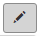 icon that is at the top right corner of Employee List. A dropdown menu (as shown in Figure 1) is displayed. The current active layout is highlighted by light-blue in the menu.
2. Selects one of the layouts in the menu, the selected layout will be applied to the Employee List automatically.

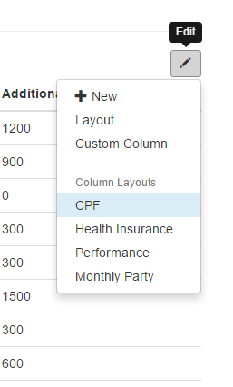

*Figure 1*

#### Create a new layout
You can always create a new column layouts.
1. Select 'Layout' in the menu shown in Figure 1. A dialog box (as shown in Figure 2) is displayed .

  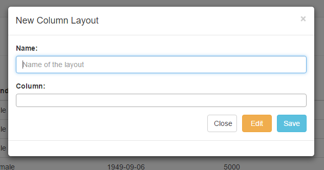

  *Figure 2*
  
2. In the 'Name' field, enter the name of your new layout. This name will be displayed in the dropdown menu.

3. In the 'Column' field, select the columns that you want to show in your new layout (as shown in Figure 3).

  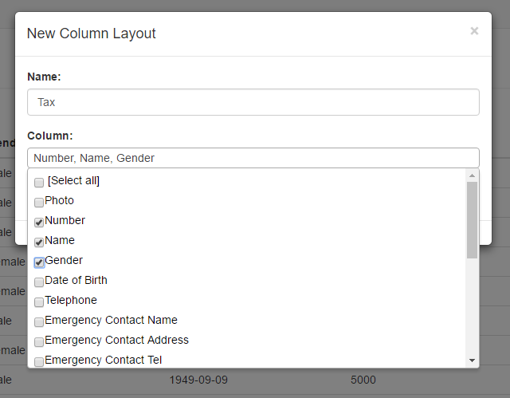

  *Figure 3*

4. When you've completed your layout setting, click **Save**. The layout will be applied to Employee List page and saved to database automatically.

#### Edit a saved layout
You can also edit a saved layout.

1. Click **Edit** on New Column Layout dialog box (Figure 2). Another dialog box (as shown in Figure 4) for editing layout will be displayed.

  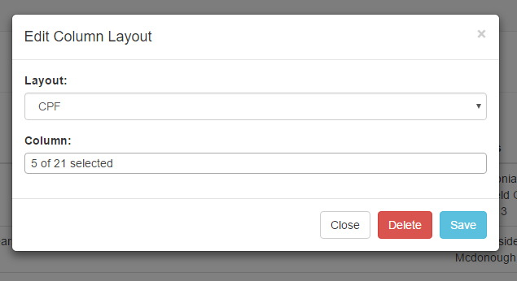

  *Figure 4*
  
2. In the 'Layout' field select the layout you want to edit.
3. In the 'Column' field check the columns you want to show and uncheck the columns that you want to hide.
4. When you've completed your editing, click **Save**. The edited layout will be applied to Employee List page and the modification will be save automatically.

#### Delete a saved layout
You can delete a layout once it is not required anymore.
1. Click **Delete** on Edit Column Layout dialog box (Figure 4). A confirm box (as shown in Figure 5) is displayed.

  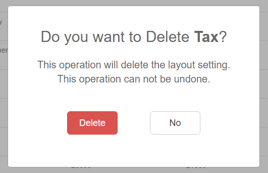

  *Figure 5*
2. If you click **Delete**, the deletion will be completed. If you click **No**, nothing will be changed.

### II Custom Column

If you have certain metric that you'd like to see reported on Employee List page, you can create a custom column.
1. Select 'Custom Column' in the menu shown in Figure 1. A dialog box (as shown in Figure 6) is displayed .

  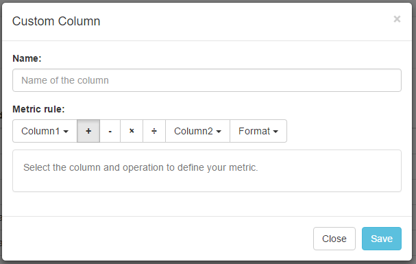

  *Figure 6*

2. In the 'Name' field, enter the name of your new column. This name will be displayed in the column header.
3. In the 'Metric rule' field, you need to select the columns and the operations (+,-,x, /) to build you formula. The formula is displayed in the help panel (as shown in Figure 7).

  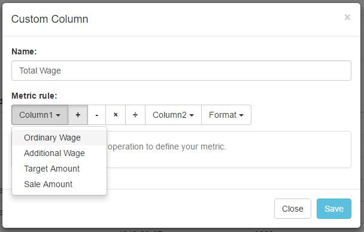

  *Figure 7*

4. (Optional) You can also specify the format of the contents in your new column (as shown in Figure 8).

  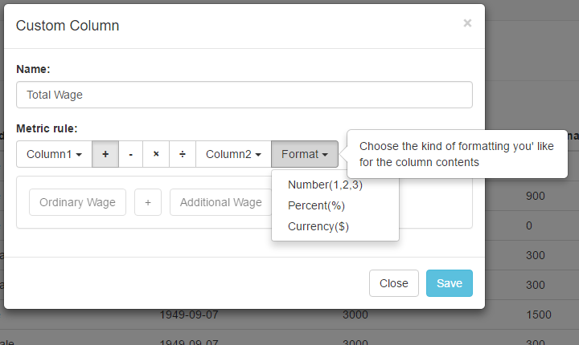

  *Figure 8*

5. When you've completed, click **Save**. The new column will be added to your current layout and saved to database automatically.

### III Download Employee List
When you want to share the information in current Employee List page, you can download the content as Excel file.
1. Click on the  that is at the top left corner of Employee List.  
2. An Excel file (as shown in Figure 9) named by current layout will be downloaded into you local. The link and image will NOT be included.

  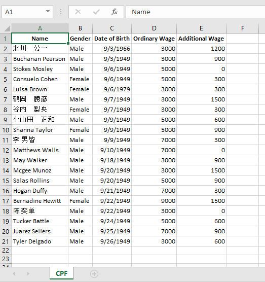

  *Figure 9*

### IV Misc.

**Sticky Header**
It may confuse you when the contents in different columns look similar (e.g. the contents of Ordinary Wage & Additional Wage are both numbers). There for a sticky header is provided. When your window is scrolled over the table header, a sticky header shows on the top of the page so that you won't mix up the columns.

  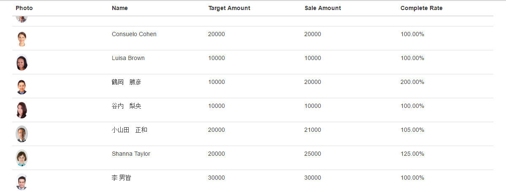

  *Figure 10*
